


 

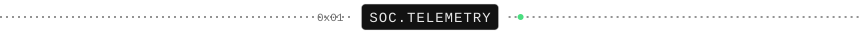


📡 pulled straight from the GitHub API every 6 hours by <code>scripts/telemetry.py</code>. no third-party stat cards.

 

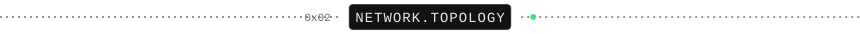

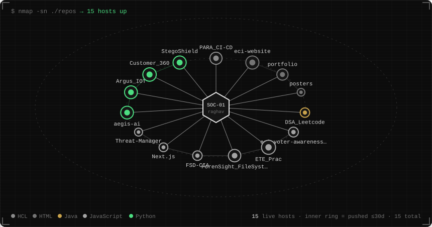

🕸️ every repo is a host on my network. inner ring = touched in the last 30 days · packets flow to anything I pushed this fortnight · colour = language

 

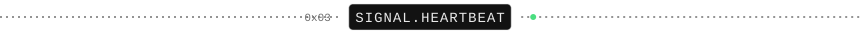


💓 my contribution graph as a heart monitor. one beat per day for the last year, spike height = commits.

 

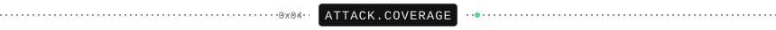


🎯 what my projects actually catch, mapped to MITRE ATT&CK. AEGISX rules, ARGUS threat scenarios, StegoShield steganalysis and the CI/CD security gates.

 

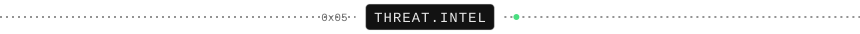


🚨 what attackers are exploiting right now: the latest additions to CISA's Known Exploited Vulnerabilities catalog, refreshed every 6 hours.

 

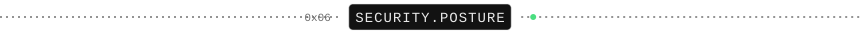


🧾 I audit my own repos like I'd audit anyone else's. every repo is checked for a security policy, Dependabot, CI, license and docs, then graded.

 

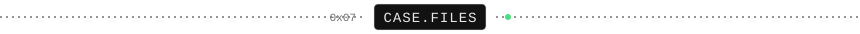

| case | what it does | stack |
|---|---|---|
| 🛡️ [**ARGUS**](https://github.com/raghavanand-prog/Argus_IOT) | Closed-loop IoT intrusion detection: detect → correlate → explain → enforce → verify, with a hash-chained evidence bundle for every autonomous action | Python · TypeScript |
| 🤖 [**AEGISX**](https://github.com/raghavanand-prog/aegis-ai) | AI-assisted SOC: live telemetry, versioned rules plus an Isolation Forest, WebSocket streaming and an evidence-grounded AI analyst | Python · PostgreSQL · TS |
| 🚦 [**Secure AWS CI/CD**](https://github.com/raghavanand-prog/PARA_CI-CD) | A deployed DevSecOps pipeline where SAST, SCA, secrets, IaC and container scans are enforced deploy gates | AWS · Terraform · Docker |
| 🖼️ [**StegoShield**](https://github.com/raghavanand-prog/StegoShield) | LSB image steganography plus an ML steganalysis classifier, with 70 passing tests | Python · Flask · scikit-learn |
| 🧩 [**Customer360**](https://github.com/raghavanand-prog/Customer_360) · [live](https://customer360-console.vercel.app/) | Customer data platform: PySpark data quality, identity resolution, a role-secured FastAPI backend and a React console | PySpark · FastAPI · React |
| 🔍 [**ForenSight**](https://github.com/raghavanand-prog/ForenSight_FileSystem) | Digital forensics file-system inspector with evidence report management | React · Express · Node.js |

 

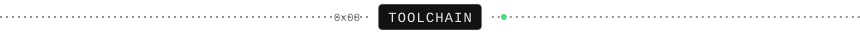

  

 

🔒 sensors armed // logs rotating // see you on the wire

